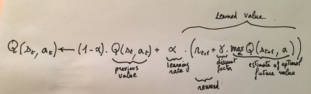
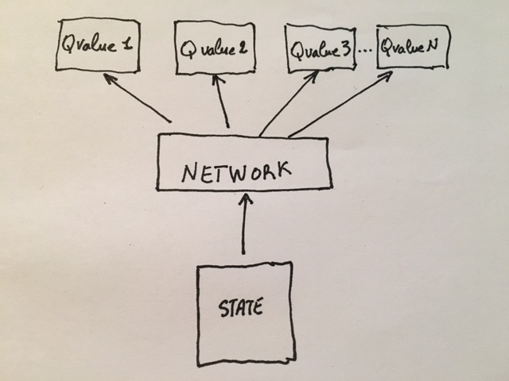
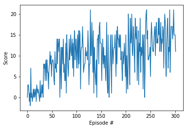

# Training An Agent To Solve A Task using a (Shallow) Q-Network

## Algorithm 

For this toy example, the problem is to solve in UNITY ML environment a banana collection task, namely collect as many yellow bananas as possible while avoiding blue bananas.

First, let's define some terminology.

The world we address is defined as a Markovian Decision Process MDP with states s, action a, reward r and the conditional Probability P
of future state s' given current state s, action a, reward r and discount factor gamma.

**Environment**: The conditional distribution of the state transitions and the reward function constitute the model of the environment.

**Action**: set A of available move from a given state s to a state s'. Only the elements of the set A where P(s'|s,a) > 0 are considered. 

**Episode**: An episode is a complete sequence of events from an initial state to a final state.

**Terminal states**: The states that have no available actions are called terminal states.

**Cumulative reward**: The cumulative reward is the discounted sum of rewards accumulated throughout an episode.

**Policy**: A Policy is the agent’s strategy to choose an action at each state.

**Optimal policy**: the policy that maximizes the expectation of cumulative reward.

The problem is modeled as an episodic task during which the agent has to maximize the expected cumulative rewards.
Because we choose to model the solution as a Q-Learning algorithm, the agent implements the following equation:

We are calculating the difference between what the Q approximation expects in the future plus the realized reward and its present value as forecasted by the neural network.

This equation makes sense with boundary conditions. If the state is terminal, the value of the state is zero. If the state is not terminal its value is given by Q() of previous state and action a.

The state is the input to the network while the network output contains the Q value of every action possible.

This model assumes that during a training episode the consequences of actions are on average correlated with the state from which these actions are performed. If this assumption is not valid we are trying to model a random walk.

How do we train this network to approximate the optimal Q function? By trial and error. We will play applying our policy from a given state a number of times keeping note of the best reward. Then we will backpropagate the error gradient 

(R - Q(s,a))

 of the best move in the network using the DQN equation above. Therefore by accumulating experiences about the environment we will slowly approximate the best strategy to accumulate rewards in this environment. In exploitation mode, the best strategy will be our policy.

The algorithm has two parts: exploration and expoitation.
In the exploration phase we will choose an action at random with odd ϵ or the best action from our current policy with odd (1−ϵ).
In the exploitation phase we will always choose the action selected by our policy.
The random choice during exploration is called "off-policy". The expoitation phase choices are called "in policy". 

### Learning Algorithm:
The Q-Learning algorithm takes two steps:
1)	A sample step
2)	A learn step

To sample the environment a Multi Layer Perceptron is used to estimate the value actions based on environment observations.

Experience replay is used to reduce the oscillations of the output function of the network and accelerate the learning process by emphasizing the most meaningful samples. 
During the Learning step, a batch of past experiences is randomly sampled to train the agent.
The randomness of this experiences selection, helps also the learning process by reducing correlation between input samples. 

### Hyperparameters:
The parameters pertaining to the algorithms are

•	Replay buffer size: int(1e5)

•	Minibatch size: 64 

•	Discount factor: 0.99  

•	Learning rate: 5e-4

•	Update rate: 4

•	Soft Update of Target Parameters (how often to update the network): 4

•	epsilon init value, final value, update value

The parameters pertaining to the network are

• Number of layers and nodes: 1 input layer with 37 nodes, 2 hidden layers with 40 fully connected nodes, 1 output fully connected layer layer with 4 nodes.

• Activation function: ReLu

• The neural network optimizer: Adam optimizer and its parameters.

### Model Architecture:
The model architecture is defined by 5 variables:
State_size is the input dimensions of the network
Action_size is the output dimensions of the network 
Seed will initialize the weights of the network 
fc1_units and fc2_units are the number of nodes in the hidden layers of the network

The input layer has 37 nodes corresponding to the velocity, the first hidden layer has 40 and the second 40 nodes. The output layer has four nodes one for each action.
Optimizing the number of nodes in the network leads to faster learning and better generalization.
By setting the number of hidden layers to two and using dichotomy node sampling, I eventually found that 40 hidden nodes on two hidden layers give better results than a larger network.

### Training:
The training runs for 2000 episodes with 1000-time steps per episode using an epsilon-greedy policy. When the average of the 100 most recent scores reaches 13 the problem is considered solved and the algorithm stops. 

A training episode is conducted as follows:
1)	Select the  most likely agent action given the current state and epsilon.
2)	Retrieve the environment response and update next state, reward and done flag
3)	Update the agent structure with present state, present action, reward and next state
4)	Update the state
5)	Update the reward

Every so episodes decrease the value of epsilon towards zero.

The scores achieved during the learning process are:

Episode 100	Average Score: 6.28

Episode 200	Average Score: 10.24

Episode 300	Average Score: 12.94

Episode 302	Average Score: 13.04

Environment solved in 202 episodes!	    Average Score: 13.04

End Score: 19.0

### Plot of Rewards

### Ideas For Future Work:
    There are may different ways this project can be improved. However, the problem we have to solve is simple and it is not warranted that
    resource hungry refinements are necessary in this case.
	 The list of classical algorithms that could be tried includes double DQN, dueling DQN and prioritized experience replay.

